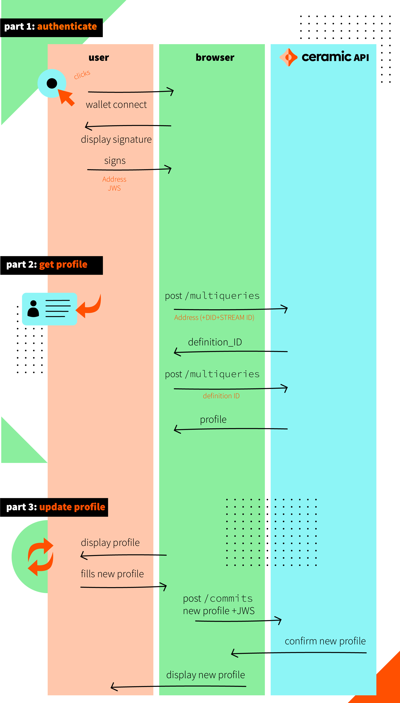

# ceramic for dummies

## motivation

This project it is two fold
- It provides a schematic flowchart of what happens under the hood when retrieving and updating profiles on the Ceramic network by connecting your wallet/using sign in with Ethereum. 
- It also provides a small app for retrieving profiles on the Ceramic network to demonstrate that no wallet is needed when querying ceramic network.

The flowchart explains what happens in the app from the Ceramic tutorial https://blog.ceramic.network/getting-started-with-ceramic/ It focuses on the interactions between a user, its browser with a wallet and the Ceramic network API. It is separated in 3 parts: 1. authentication with sign in with ethereum, 2. fetching a profile and 3. updating a profile.

The demo app focuses on the 2nd part for querying a profile on the ceramic network but without connecting a wallet. The only input is a public wallet address thus displaying the public ceramic profile. It shows how to compute determistically and offline the stream ID from the ETH address and how to use this stream ID to query ceramic network API. Note that the demo app restricts to 'kovan' testnet and 'basic profile' definition for the stream type 'tile' of ceramic but these can be extended. 



## technical details
For the flowchart, Adoble illustrator was used.

For the demo app, the point is not to use any web3 / ceramic specific library to query a profile from an ETH adress. The function 'getProfile' computes offline the stream ID from ETH adress - see 'hash' and then fetches 2 times the ceramic network API - first for the definition ID and then the profile. Hashing functions/libraries are used for 'hash', these are the only imports. This function 'hash' shall be useful in itself, it could not be found except from patching together various ceramic libraries. Other parts of the code are similar to the initial tutorial, no frontend framework. This is just a minimal code to better understand how to use ceramic. This can also be used as a base to show ceramic profile without a wallet.

## run demo app
Convert `main.js` with webpack
```bash
npm run build
```

No frontend framework, run with a tool like https://www.npmjs.com/package/static-server or visual extension https://visualstudio.microsoft.com/services/live-share/